# HTMLSourceCodeElement

Rich HTML code element with a native API.

<a href="#integration">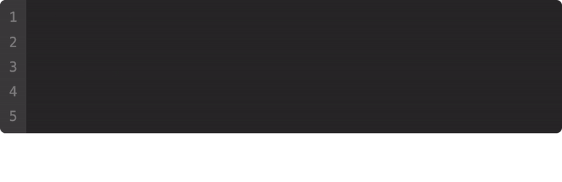</a>

[1. Integration](#integration)  
[2. Attributes](#attributes)  
&emsp; [2.1 `copy`](#copy)  
&emsp; [2.2 `edit`](#edit)  
&emsp; [2.3 `type`](#type)  
&emsp; [2.4 `language`](#language)  
&emsp; [2.5 `scroll`](#scroll)  
[3. Themes](#themes)  
&emsp; [3.1 `min`](#min)  
&emsp; [3.2 `common`](#common)  
&emsp; [3.3 `outline`](#outline)  
[4. Highlighting](#highlighting)  
&emsp; [4.1 `glitch`](#glitch)  
&emsp; [4.2 `matrix`](#matrix)  

## Integration

#### From CDN

`recommended`

``` html
<script src="unpkg.com/@t-ski/html-code-element/dist/HTMLCodeElement.<theme>[.<highlighting>].js"></script>
```

`<theme>` is a placeholder for an element theme identifier ([browse Themes](#themes)).  
`<highlighting>` specifies an optional syntax highlighting scheme ([browse Highlighting](#highlighting)).

> `<script src="unpkg.com/@t-ski/html-code-element/dist/HTMLCodeElement.common.glitch.js"></script>``

#### From NPM

``` console
npm i @t-ski/html-code-element
```

``` ts
load(theme: string = "min", highlighting?: string);
```

``` js
import { load } from "@t-ski/html-code-element";

load("common", "glitch");
```

#### Usage

``` html
<source-code edit type language="py">
  print('Hello, world!')
</source-code>`
```

> ℹ️ Anything slotted within the `<source-code>` is detected as code contents. HTML code snippets particularly do not have to be escaped.

## Attributes

#### `copy`

<sub>`singleton`</sub>
``` html
<source-code copy>
```

Make element copyable by hover activated button.

#### `edit`

<sub>`singleton`</sub>
``` html
<source-code edit>
```

Make element editable like a script editor.

#### `scroll`

<sub>`singleton`</sub>
``` html
<source-code type>
```

Make element scrollable at horizontal overflow, instead of wrap.

#### `type`

<sub>`singleton`</sub>
``` html
<source-code type>
```

Make element as if a human would type the code.

#### `language`

``` html
<source-code language="php">
```

Specify language to help with highlighting (if necessary).

#### `maxheight`

``` html
<source-code maxheight="php">
```

Specify maximum amount of lines after which to enable vertical scroll.

> ℹ️ A minimum of `5` lines are shown when used with `type`.

---

### Attributes API

The DOM class `HTMLSourceCodeElement` is associated with the `<source-code>` tag. The DOM class provides a static configuration function to override certain attributes globally.

``` ts
HTMLSourceCodeElement
.globalAttrs(attrs: { [name: string]: boolean; });
```

``` js
HTMLSourceCodeElement
.globalAttrs({
  copy: true,
  edit: false
});
```

> ℹ️ A global configuration does not invert, but override individual attributes.

## Themes

#### `min`

``` html
<script src="…/HTMLCodeElement.min[.<syntax>].js">
```

Minimal editor theme.

<div>
  <a href="#themes"></a>
  &emsp;
  <a href="#themes">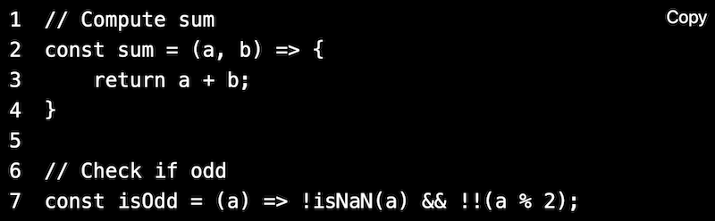</a>
  <br><br>
</div>

#### `common`

``` html
<script src="…/HTMLCodeElement.common[.<syntax>].js">
```

<div>
  <a href="#themes">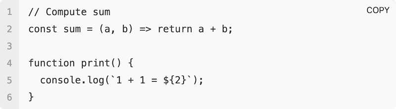</a>
  &emsp;
  <a href="#themes">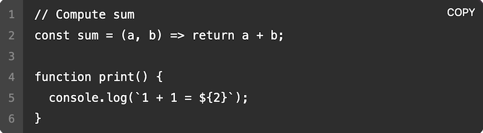</a>
  <br><br>
</div>

#### `outline`

``` html
<script src="…/HTMLCodeElement.outline[.<syntax>].js">
```

<div>
  <a href="#themes"></a>
  &emsp;
  <a href="#themes">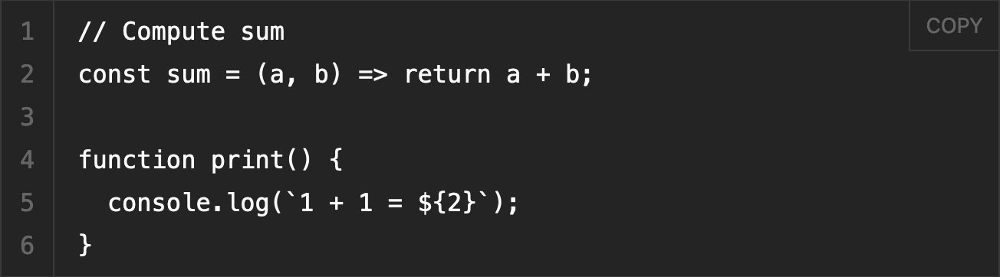</a>
  <br><br>
</div>

#### `opaque`

``` html
<script src="…/HTMLCodeElement.opaque[.<syntax>].js">
```

<div>
  <a href="#themes">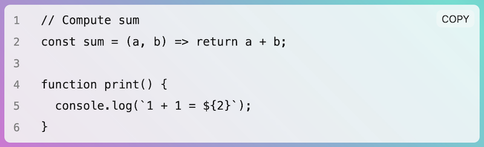</a>
  &emsp;
  <a href="#themes">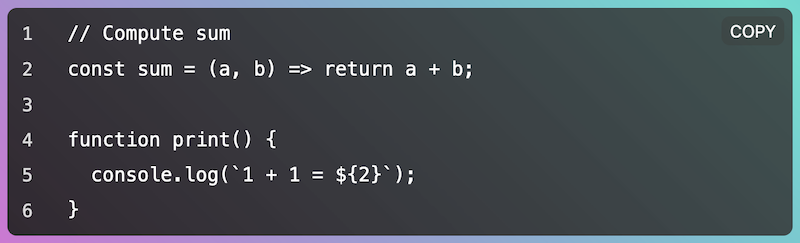</a>
  <br><br>
</div>

> ℹ️ Themes adopt the colour scheme preferred by the user.

---

### Theme API

Using the `addStylesheet()` method, custom styles can be injected into the `<source-code>` shadow DOM. The method exists both statically on `HTMLSourceCodeElement`, as well as on each individual instance. The method must be passed a URL to a stylesheet. Alternatively, an existing `<link>` or `<style>` element can be reused through a reference.

``` ts
(HTMLSourceCodeElement|instanceof HTMLSourceCodeElement)
.addStylesheet(stylesheet: HTMLStyleElement|HTMLLinkElement|string);
```

In a stylesheet, the `:host` selector refers to the encompassing `<source-code>`. The internals of the shadow DOM base on the following markup:

``` html
<div class="edit"></div>
<code class="display">
  <table>
    <tr class="line" *>
        <td class="line-number">
            <span>
              <!-- Individual line number -->
            </span>
        </td>
        <td class="line-code">
            <pre mirror>
              <!-- Individual line code -->
            </pre>
        </td>
    </tr>
  </table>
</code>
<button type="button" class="copy">Copy</span>
```

## Highlighting

Syntax highlighting is an optional addition to the basic API. In fact, it requires [highlight.js](https://highlightjs.org/) to work:

``` html
<head>
  <script src="https://unpkg.com/@highlightjs/cdn-assets/highlight.min.js"></script>
  <script src="unpkg.com/@t-ski/html-code-element/dist/HTMLCodeElement.common.glitch.js"></script>
  <script>
    HTMLCodeElement.on("highlight", (code, language) => {
      return ´language
            ? hljs.highlight(code, { language }).value
            : hljs.highlightAuto(code).value);
    });
  </script>
</head>
```

#### `glitch`

``` html
<script src="…/HTMLCodeElement.<theme>.glitch.js">
```

<div>
  <a href="#themes">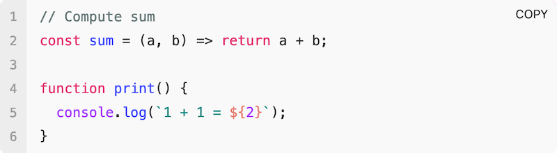</a>
  &emsp;
  <a href="#themes">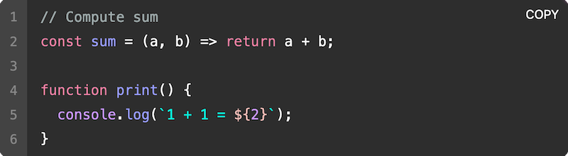</a>
  <br><br>
</div>

#### `matrix`

``` html
<script src="…/HTMLCodeElement.<theme>.matrix.js">
```

<div>
  <a href="#themes">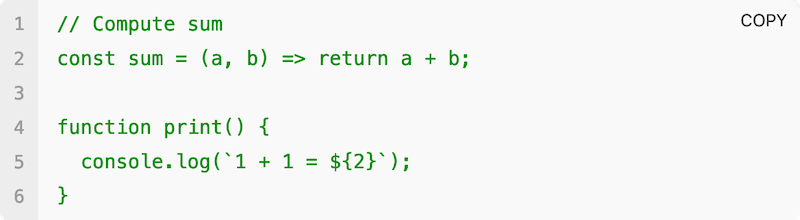</a>
  &emsp;
  <a href="#themes">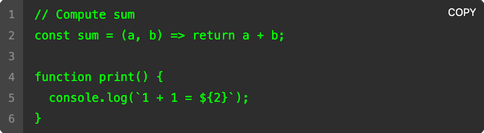</a>
  <br><br>
</div>

---

### Config API

The `HTMLSourceCodeElement` provides reasonable commons for abstract visual or behavioural aspects. For instance, the tab width is two spaces by common. However, such aspects can be manipulated in a fashion similar to defining global attributes.

``` ts
HTMLSourceCodeElement
.config(overrides: { [name: string]: unknown; });
```

``` js
HTMLSourceCodeElement
.config({
  tabWidth: 4
});
```

> ℹ️ A global configuration does not invert, but override individual attributes.

### Events API

The `HTMLSourceCodeElement` DOM class provides a static API to handle events in a custom fashion.

``` ts
HTMLSourceCodeElement
.on(event: string, cb: (...args: unknown[]) => unknown)
```

#### on `copy`

``` ts
HTMLCodeElement.on("copy", (dom: {
  host: HTMLSourceCodeElement;
  edit: HTMLDivElement;
  display: HTMLCodeElement;
  table: HTMLTableElement;
  copy: HTMLButtonElement;
}) => void)
```

Callback fires whenever code is copied. The callback is passed the respective element's shadow DOM key elements. The DOM might be used to to reflect that the code was in fact copied.

#### on `highlight`

``` ts
HTMLCodeElement.on("highlight", cb: (code: string, language?: string) => string)
```

Callback fires whenever code is rendered. The callback is passed the respective raw code to highlight. If the respective element has an assigned `language` attribute that value is also passed.

## 

<sub>&copy; Thassilo Martin Schiepanski</sub>