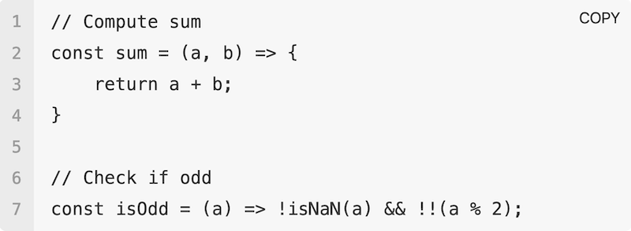
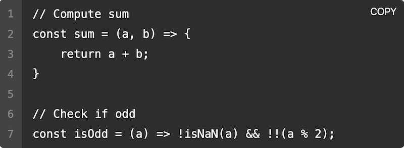
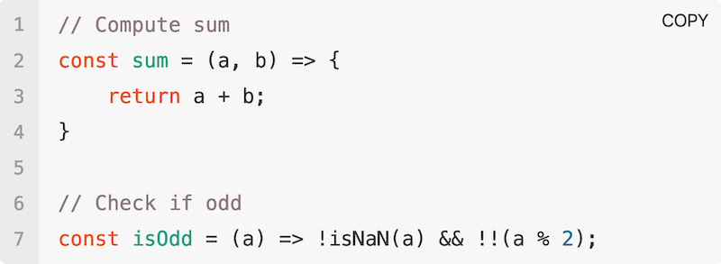
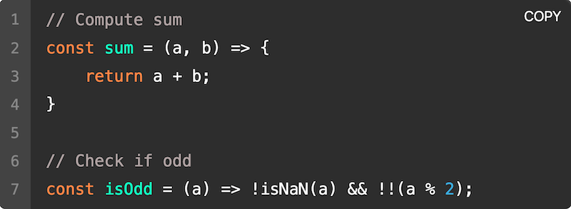
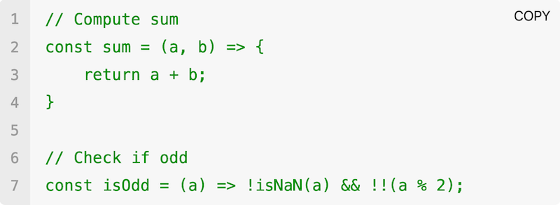
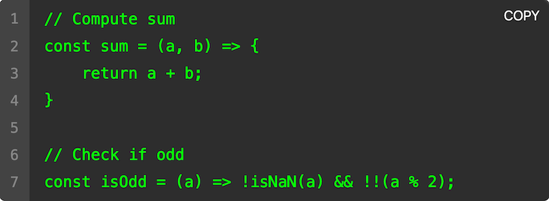

# HTMLSourceCodeElement

Rich HTML code element with a native API.

``` html
<source-code edit type language="js">
  // Compute sum
  const sum = (a, b) => {
    return a + b;
  }
</source-code>`
```

<a href="#integration"></a>

[1. Integration](#integration)  
[2. Attributes](#attributes)  
&emsp; [2.1 `copy`](#copy)  
&emsp; [2.2 `edit`](#edit)  
&emsp; [2.3 `type`](#type)  
&emsp; [2.4 `language`](#language)  
&emsp; [2.5 `scroll`](#scroll)  
[3. Themes](#themes)  
&emsp; [3.1 `min`](#default)  
&emsp; [3.2 `default`](#default)  
[4. Syntax Highlighting](#syntax-highlighting)  
&emsp; [3.1 `autumn`](#autumn)  
&emsp; [3.2 `matrix`](#matrix)  
[5. Events API](#events-api)  
&emsp; [3.1 on `copy`](#on-copy)  
&emsp; [3.2 on `highlight`](#on-highlight)  

## Integration

``` html
<script src="unpkg.com/@t-ski/html-code-element/dist/HTMLCodeElement.<theme>[.<syntax>].js"></script>
```

| | | |
| -: | :- | :- |
| `<theme>` | General element theme | [Browse Themes](#themes) |
| `<syntax>` | Syntax highlighting theme | [Browse Syntax Highlighting](#syntax-highlighting) |

``` html
<source-code edit language="html">
  <em>Not rendered with emphasis, but literally.</em>
</source-code>`
```

## Attributes

#### `copy`

<sub>`singleton`</sub>
``` html
<source-code copy>
```

Make element copyable by hover activated button.

#### `edit`

<sub>`singleton`</sub>
``` html
<source-code edit>
```

Make element editable like a script editor.

#### `scroll`

<sub>`singleton`</sub>
``` html
<source-code type>
```

Make element scrollable at horizontal overflow, instead of wrap.

#### `type`

<sub>`singleton`</sub>
``` html
<source-code type>
```

Make element as if a human would type the code.

#### `language`

``` html
<source-code language="php">
```

Specify language to help with highlighting (if necessary).

#### `maxheight`

``` html
<source-code maxheight="php">
```

Specify maximum amount of lines after which to enable vertical scroll.

> A minimum of `5` lines are shown when used with `type`.
 
## Themes

#### `min`

``` html
<script src="…/HTMLCodeElement.min[.<syntax>].js">
```

Minimal editor theme.

| | |
| - | - |
| <a href="#themes"></a> | <a href="#themes"></a> |

#### `default`

``` html
<script src="…/HTMLCodeElement.default[.<syntax>].js">
```

Default editor theme.

| | |
| - | - |
| <a href="#themes"></a> | <a href="#themes"></a> |

## Syntax Highlighting

Out-of-the-box syntax highlighting is an optional addition to the basic API. In fact, it requires [highlight.js](https://highlightjs.org/) to work:

``` html
<head>
  <script src="https://unpkg.com/@highlightjs/cdn-assets/highlight.min.js"></script>
  <script src="unpkg.com/@t-ski/html-code-element/dist/HTMLCodeElement.default.autumn.js"></script>
  <script>
    HTMLCodeElement.on("highlight", (code, language) => {
      return ´language
            ? hljs.highlight(code, { language }).value
            : hljs.highlightAuto(code).value);
    });
  </script>
</head>
```

> ℹ️ Omit a syntax highlighting specifier to skip highlighting.

#### `autumn`

``` html
<script src="…/HTMLCodeElement.<theme>.autumn.js">
```

Cozy, autumn inspired syntax highlighting.

| | |
| - | - |
| <a href="#syntax-highlighting"></a> | <a href="#syntax-highlighting"></a> |

#### `matrix`

``` html
<script src="…/HTMLCodeElement.<theme>.matrix.js">
```

All green, Matrix (1999) inspired syntax highlighting.

| | |
| - | - |
| <a href="#syntax-highlighting"></a> | <a href="#syntax-highlighting"></a> |

## Events API

The DOM class associated with the `<source-code>` tag is `HTMLSourceCodeElement`. The class provides a static event handler API to customise its behaviour.

``` ts
HTMLSourceCodeElement.on(event: string, cb: (...args: unknown[]) => unknown)
```

#### on `copy`

``` ts
HTMLCodeElement.on("copy", (dom: {
  edit: HTMLDivElement;
  table: HTMLTableElement;
  copy: HTMLButtonElement;
}) => void)
```

Callback fires whenever code is copied. The callback is passed the respective element's shadow DOM key elements. The DOM might be used to to reflect that the code was in fact copied.

#### on `highlight`

``` ts
HTMLCodeElement.on("highlight", cb: (code: string, language?: string) => string)
```

Callback fires whenever code is rendered. The callback is passed the respective raw code to highlight. If the respective element has an assigned `language` attribute that value is also passed.

## 

<sub>&copy; Thassilo Martin Schiepanski</sub>